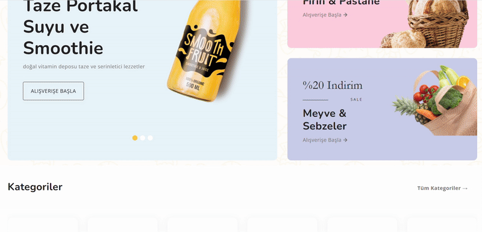

🛒 FoodMart – E-Ticaret Projesi
🔧 ASP.NET Core 8.0 & 🍃 MongoDB ile geliştirilen kapsamlı bir alışveriş platformu!

🎯 Özellikler
🛍️ Tüm Ürün ve Kategori Yönetimi

💸 Dinamik İndirimler (Ürün/Kategori Bazlı)

📧 İndirim Kodlarını MailKit ile Otomatik Gönderme

🔑 Güvenli Admin Giriş/Çıkış (Session Kontrollü)

🔄 AutoMapper & DTO ile Katmanlar Arası Veri Aktarımı

🧩 ViewComponent ile Modüler Razor Yapısı

💻 Kullanılan Teknolojiler
⚙️ ASP.NET Core 8.0

🍃 MongoDB

✉️ MailKit

🧾 DTO

🧩 ViewComponent

🔐 Session Management

## 🎬 Uygulama Demoları

### 🏠 Ana Sayfa

